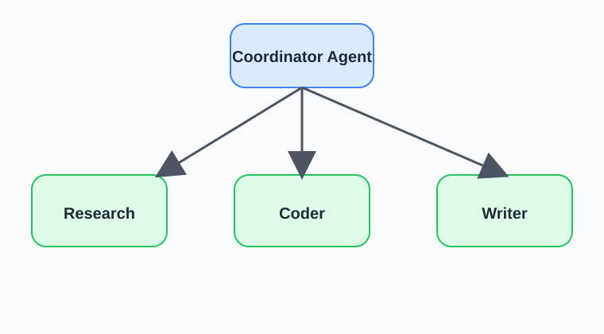

# Coordinator Architecture Pattern

## Original Agent
[source file](./agent.py)

### Explanation

In this pattern a coordinator agent decides to which agent it routes to based on the user prompt, context, agent results and its instructions.

Imagine a coordinator agent has a choice delegating to a writer, a coder or a research agent.



If the user prompt is `"Research NVIDIA's latest financial results and write a report."` it may first route to the research agent and then to the writer agent.

If however the user prompt is `"Fix this Python code and explain the changes."` it probably first routes to the coder agent and then to the writer agent.

So there is no predefined path of agent execution. The sequence lies in the hands of the coordinator agent.

Even though there are clear instructions for the coordinator agent that it must use the research agent first, it is not guaranteed. It is just a "biased toward" but not an "enforced deterministic workflow" behavior.

### Agent State

Agents share the same session state. Each agent can write its output in the session state under a self-defined key (e.g. `research_findings`). The value of this key can be injected in the instructions of another agent with `{<state_key>}`.

## Experimental Agent
[source file](./agent_experiment.py)

I created a coordinator agent that orchestrates two specialized agents:
* `PythonCodeAgent`
* `PythonCodeReviewAgent`

The coordinator is instructed to first generate Python code based on the user's request and then pass that output to the review agent for refinement. The final result is produced by combining both stages.

The coding agent writes its output to a session-state key, and that value is injected into the review agent's instruction prompt.

I found that a clear pattern for an agent instruction prompt is:
```
Role:
...

Goal:
...

Task:
1. ...
2. ...
```

In the Task section, you outline the steps the agent should take to reach its goal.