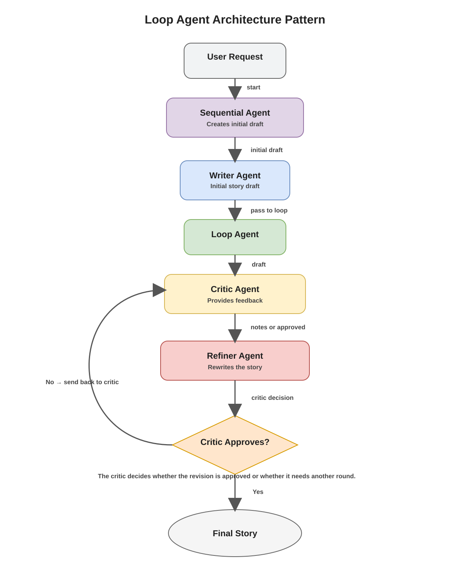

# Loop Agent Architecture Pattern

## Original Agent
[source file](./agent.py)

A loop agent repeatedly invokes the same sub-agents until a specific condition is met. This pattern is useful when an initial output needs iterative improvement through feedback and revision.

In this example, an initial writer agent creates the first draft of a story. The loop agent then passes that draft to a critic agent, which provides feedback on what could be improved. The draft and the critique are sent to a refiner agent, which rewrites the story. This revised version is sent back to the critic agent, which evaluates it again until the result is approved. The refiner agent ultimately ends the loop by calling a designated tool function.

A sequential agent is also required because the initial writer agent must create the first draft before the loop agent takes over.

## Agent Experiments
[source file](./agent_experiment.py)