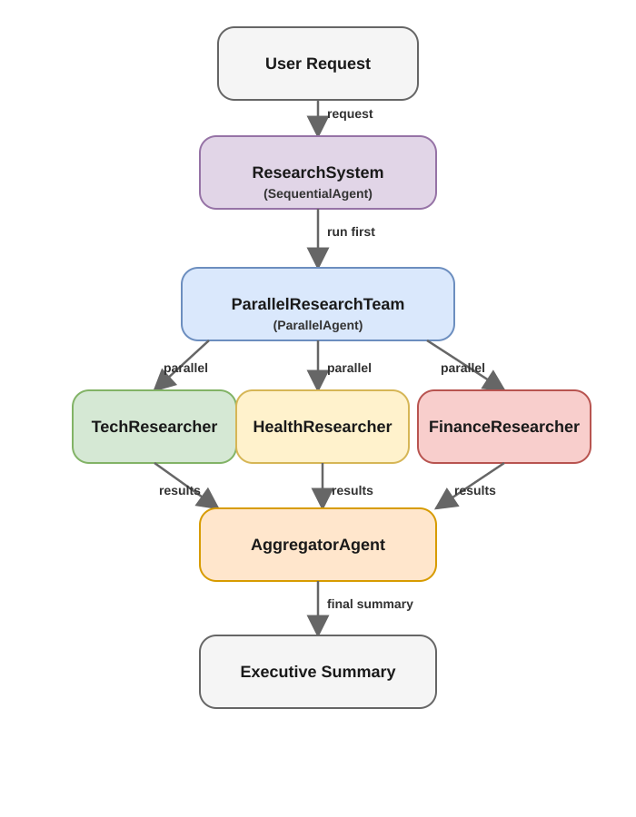

# Parallel Agents Architecture Pattern

## Original Agent
[source file](./agent.py)

A `parallel agent` is useful when multiple sub-agents can work independently at the same time. Instead of waiting for one agent to finish before starting the next, the system launches several agents concurrently and then combines their results.

In this example, three research agents focus on different areas: technology, health, and finance. Each agent gathers the information needed for its domain in parallel. Once all three have completed their work, their outputs are passed to an aggregator agent, which synthesizes them into a single final report.

To coordinate this workflow, a sequential agent is used at the top level: the parallel research team runs first, and then the aggregator agent processes the combined results.

## Agent Experiments
[source file](./agent_experiment.py)

Because `google.adk.agents.ParallelAgent` is deprecated, the workflow must be implemented with `google.adk.workflow.Workflow`, using a graph of nodes and edges.

The graph begins at the `google.adk.workflow.START` node, which routes execution to the research agents so they can run concurrently.

The outputs from the research agents are sent to a `google.adk.workflow.JoinNode` so the aggregator does not start as soon as one agent finishes. The `JoinNode` waits until all parallel results have been collected, and only then continues the flow to the aggregator agent, which synthesizes the final report.