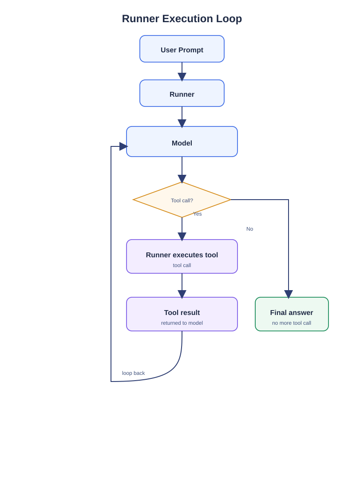

# Single Agent
[source code](./agent.py)

## Agent
The agent in the example code is created by the `google.adk.agents.Agent` class. It needs a _name_, an optional _model_, an optional _description_, an optional _instruction_ and optional _tools_ list.

Conceptually it is the base class of the specific agent classes `LlmAgent`, `WorkflowAgent`, `SequentialAgent`, `ParallelAgent`, `LoopAgent`.

### Name
The name of the agent acts as the agents identifier at runtime. ADK internally addresses an agent by its name. The agent names also appear in the logs. Usually the names are in lower snake case, should be descriptive and have a role in it (`_agent`, `_planner`, `_researcher`, `_assistant`, ...).

### Model
ADK mainly supports the Gemini model family (like `gemini-3.5-flash-lite`). For other models you need to write a custom wrapper/adapter.

The model can be configured with an optional retry config (if omitted defaults will apply).

The config in the example code says that when certain HTTP errors occur the model should retry at specific times until a max amount of attempts is reached:
* Retry 1: 1s
* Retry 2: 7s (7 * 1s)
* Retry 3: 49s (7 * 7s)
* Retry 4: 343s (7 * 49s)
* Retry 5: 2401s (7 * 343s)

An interesting fact is that the `model` field is optional for the `Agent` class because it represents a general agent that does not necessarily have a model.

### Description
Description is an optional field. It gives the code reader a hint what the agent is about. However mostly it makes sense in a multi-agent environment. An agent can know to which agent to delegate to by its description.

### Instruction
An instruction controls and shapes the behavior of an agent. It is the specification of the agent's behavior.

Usually an instruction should contain these mandatory infos:
* Role – Who is the agent?
* Goal – What should it accomplish?
* Task – What exactly should it do?

Optional are these infos:
* Process / Workflow – How should it work?
* Tool Usage – When/how should it use tools?
* Constraints – What must it avoid?
* Decision Rules – How should it handle different situations?
* Output Format – How should it structure its response?
* Error Handling – What should it do when something goes wrong?
* Examples – Examples of desired behavior/output.

The lists above can act as checklists for writing a good instruction prompt.

For production-ready agents, the instruction prompt should be thoughtfully designed, tested, and refined.

### Tools
The tools field is a list of tools the agent can use. There are tools like `google.adk.tools.google_search` among others built-in the Gemini models.

## Runner
The runner is essentially the orchestrator. It receives a root agent and a user prompt and manages the agent's execution loop.

When the model decides to call a tool, the runner executes the tool and feeds the result back to the model. The model can then use the result, along with the existing context, to decide whether it needs to make another tool call or generate the final response.

This loop continues until the model produces a final answer or the execution otherwise terminates.

[Open the editable draw.io source](./assets/runner-execution-loop.drawio)

The runner can  run in debug (`run_debug()`) or production mode (`run()`). In debug mode you will see what the agent is doing behind the scenes.

# Single Agent Experiments
[soruce code](./agent_experiment.py)

## Agent
I use the `google.adk.agents.LlmAgent` class instead of `google.adk.agents.Agent` to instantiate an agent. It is more specific as in this case we need an agent that has an LM (language model).

## Google Search
The Google Search tool is like the normal Google Search that we all are used to. You type in a search term and the output is a list of search results.

Depending on the user prompt the agent's model (the brain) might decide that the Google Search tool should be called because it does not know the answer from its training data. The agent's model also provides the argument string that is passed to the search function.

In my experiment I changed the agent's instruction to process each search result and provide a title, one-sentence summary and a link to each search result.